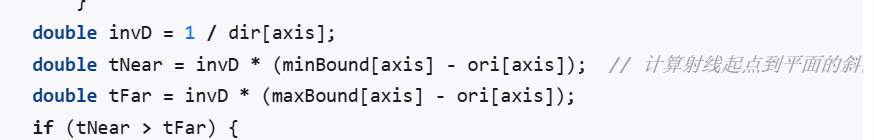

# 提问

Date Created: April 17, 2025 4:51 PM
Status: To Do

1.  内存分配
2. 值类型和引用类型
3. 装箱拆箱
4. 垃圾回收 托管内存的清理回收  **追踪式、精确式、非搬迁式、非实时、非渐进式  BeginDestroy FinishDestroy**

UE4-GarbageCollect垃圾回收机制 - Nice的文章 - 知乎
[https://zhuanlan.zhihu.com/p/448412111](https://zhuanlan.zhihu.com/p/448412111)

1. 字符串
2. il2cpp
3. 哈希表（重新寻址，拉链法）
4. 空间划分 网格和四叉树
5. 继承 封装 多态 抽象
6. 帧同步状态同步
7. 协程线程进程
8. 寻路算法 bfs Djk A*
9. 常见排序
10. Topk和堆排序
11. 字典
12. 缓存淘汰 LRU（访问时间） LFU（访问次数）
13. ECS
14. SAP碰撞算法 四叉树 BVH

游戏技能系统漫谈 - 网易游戏雷火事业群的文章 - 知乎
[https://zhuanlan.zhihu.com/p/567353885](https://zhuanlan.zhihu.com/p/567353885)

1. MVVM
2. 左值和右值有怎样的区别 移动语义  可寻址的变量——无名临时对象
3. 如何判断点是否在三角形内 右手螺旋定则叉乘
4. 如何判断射线与[AABB](https://zhida.zhihu.com/search?content_id=236934569&content_type=Article&match_order=1&q=AABB&zhida_source=entity)是否相交  ①三个轴近面求交点，判断交点是否在平面内②近面的最大值<出面的最小值

1. 大小端问题 小端的基偶性检查，类型强制转换
2. delate this 不能访问成员变量和虚函数，但是普通函数可以访问，不能析构中调用this
3. 进程的内存空间分为哪些区
4. new 和 malloc placement new operator new根据左值右值决定是否调用移动构造
5. `malloc`内部是怎样实现的**维护一个内存空闲链表，当申请内存空间时，搜索内存空闲链表，找到适配的空闲内存空间**
6. 深度测试 （深度缓存） 应用阶段 几何阶段 光栅化阶段

猴子也能看懂的渲染管线（Render Pipeline） - HkingAuditore的文章 - 知乎
[https://zhuanlan.zhihu.com/p/137780634](https://zhuanlan.zhihu.com/p/137780634)

渲染管线----通俗易懂向面试官介绍 - 五尘的文章 - 知乎
[https://zhuanlan.zhihu.com/p/402862818](https://zhuanlan.zhihu.com/p/402862818)

1. 智能指针经验 （智能指针混用，管理同一个裸指针，避免使用get获取原生指针，使用Maked Shared）
2. 泄露情况 （循环引用，对象生命周期过长，管理数组）

[https://docs.qq.com/doc/DUWR2WHZSeWNGeVN4?no_promotion=1](https://docs.qq.com/doc/DUWR2WHZSeWNGeVN4?no_promotion=1)

虚幻

1. 反射机制  使用一个类专门来描述原始类型的元数据，UClass UScriptStruct UFunction，想通过反射根据名字获取变量的值，只需要记录下Struct类型下该变量的名字，类型，以及偏移地址就可以了   UE4-UClass类型系统与反射机制的构建 - Nice的文章 - 知乎
[https://zhuanlan.zhihu.com/p/440126998](https://zhuanlan.zhihu.com/p/440126998) 

UE4反射基础一：揭秘UBT生成代码、UObject注册、UClass及CDO生成 - rayhunter的文章 - 知乎
[https://zhuanlan.zhihu.com/p/427575094](https://zhuanlan.zhihu.com/p/427575094)

- 内存构造
- 注册，登记在注册队列中
- 对象构造，数据填充（属性，函数，接口和元数据）
- 绑定链接
- CDO创建
1. 碰撞检测 CCD 基于扫列

连续碰撞检测 - CCD - ACRL的文章 - 知乎
[https://zhuanlan.zhihu.com/p/380532960](https://zhuanlan.zhihu.com/p/380532960)

1. FString动态字符串类型  FName存储和引用名称，使用全局名称表并且会创建哈希值 FText 文本显示，不可变
2. 移动组件 

「Grow by UE」图解角色移动组件 - 左加右的文章 - 知乎
[https://zhuanlan.zhihu.com/p/650314172](https://zhuanlan.zhihu.com/p/650314172)

1. FSM，行为树（心跳机制带来的消耗），StateTree，GOAP，logic driver
2. 避障算法 VO RVO【【算法扫盲计划】ORCA 避障算法】 [https://www.bilibili.com/video/BV14N4y1Z7ue/?share_source=copy_web&vd_source=8d86061981bc0fe279c9427bf2463004](https://www.bilibili.com/video/BV14N4y1Z7ue/?share_source=copy_web&vd_source=8d86061981bc0fe279c9427bf2463004)【15分钟了解群体动态避障算法ORCA(即RVO2)】 [https://www.bilibili.com/video/BV1sw411n7q3/?share_source=copy_web&vd_source=8d86061981bc0fe279c9427bf2463004](https://www.bilibili.com/video/BV1sw411n7q3/?share_source=copy_web&vd_source=8d86061981bc0fe279c9427bf2463004)
3. 技能设计  易拓展，可复用，易配置  技能系统拆解：空间（位置表现） 时间（事件时序，数据的新旧） 状态（运行时数据上下文事件属性，配置数据）